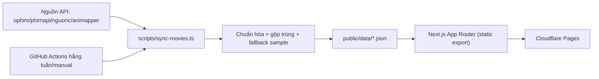

# Thiết kế hệ thống Nextflix (theo `prompt.txt`)

## 1) Mục tiêu và ràng buộc

- Web xem phim cá nhân, miễn phí, tối giản, ưu tiên tốc độ.
- Không dùng database, không backend server chạy 24/7.
- Toàn bộ dữ liệu web chính và admin đọc từ JSON tĩnh trong `public/data`.
- Next.js App Router + TypeScript + Tailwind CSS.
- Build static export (`next.config.js` dùng `output: "export"`) để deploy Cloudflare Pages.
- Có script sync dữ liệu phim và GitHub Actions chạy tự động hàng tuần hoặc chạy tay.

## 2) Kiến trúc tổng thể

Hệ thống gồm 3 lớp chính:

1. Lớp thu thập dữ liệu (offline): `scripts/sync-movies.ts`
- Chạy local hoặc GitHub Actions.
- Gọi nhiều nguồn API, chuẩn hóa, gộp trùng, sinh JSON tĩnh.

2. Lớp dữ liệu tĩnh: `public/data/**`
- Là “single source of truth” cho frontend.
- Có manifest, thống kê, index tìm kiếm, dữ liệu theo thể loại, dữ liệu chi tiết phim.

3. Lớp hiển thị web (Next.js static)
- Các trang `/`, `/phim/[id]`, `/xem/[id]`, `/tim-kiem`, `/admin/**` chỉ đọc JSON tĩnh.
- Không gọi API bên thứ ba trực tiếp ở runtime để đảm bảo ổn định và static-friendly.

## 3) Sơ đồ luồng dữ liệu



## 4) Cấu trúc thư mục (đề xuất bám prompt)

```txt
movie-personal/
  app/
    page.tsx
    phim/[id]/page.tsx
    xem/[id]/page.tsx
    tim-kiem/page.tsx
    admin/page.tsx
    admin/categories/page.tsx
    admin/categories/[slug]/page.tsx
    admin/movies/page.tsx
  components/
    Header.tsx
    MovieCard.tsx
    MovieGrid.tsx
    Player.tsx
    EpisodeList.tsx
    SourceSelector.tsx
    AdminStatCard.tsx
  lib/
    data.ts
    normalize.ts
    storage.ts
    types.ts
    sources.ts
    search.ts
  scripts/
    sync-movies.ts
  public/
    data/
      manifest.json
      stats.json
      latest.json
      search-index.json
      categories.json
      category/{slug}/page-n.json
      movies/{id}.json
  .github/workflows/sync-movies.yml
```

## 5) Thiết kế domain model

Giữ đúng model trong prompt:

- `MovieSource = "ophim" | "phimapi" | "nguonc" | "animapper"`
- `MovieListItem`
- `Episode`
- `MovieDetail`
- `Stats`

Bổ sung quy ước ID:
- `movie.id`: ổn định và duy nhất, khuyến nghị từ `globalKey` (đã normalize) + hash ngắn.
- `movie.slug`: slug thân thiện URL.

## 6) Thiết kế adapter nguồn dữ liệu (`lib/sources.ts`)

Mỗi nguồn có một adapter thống nhất interface:

- `fetchLatest(page?: number): Promise<RawMovie[]>`
- `fetchDetail(slugOrId: string): Promise<RawMovieDetail | null>`
- `enabled`, `priority`, `baseUrl`, timeout, retry nhẹ.

Mục tiêu:
- Dễ bật/tắt từng nguồn.
- Lỗi một nguồn không làm fail toàn bộ job.
- Có fallback mock/sample nếu endpoint thay đổi hoặc unavailable.

## 7) Pipeline script sync (`scripts/sync-movies.ts`)

### 7.1 Chế độ chạy

- `npm run sync` -> mặc định `mode=latest`
- `npm run sync -- --mode=latest`
- `npm run sync -- --mode=full`

### 7.2 Thuật toán chính

1. Đọc config nguồn từ env hoặc `lib/sources.ts`.
2. Gọi các nguồn đang enabled để lấy danh sách phim mới cập nhật.
3. Cố gắng lấy detail cho từng phim (song song có giới hạn concurrency).
4. Normalize dữ liệu về `MovieListItem/MovieDetail`.
5. Tạo `globalKey` để dedupe:
- Ưu tiên `originName + year`.
- Nếu thiếu `originName` dùng `name + year`.
- Normalize tiếng Việt: bỏ dấu, lowercase, ký tự đặc biệt -> `-`.
6. Nếu trùng `globalKey`:
- Giữ 1 bản chính theo ưu tiên source.
- Dồn thông tin nguồn vào `movie.sources[]`.
- Hợp nhất episode nếu thiếu.
7. Sinh file:
- `latest.json`
- `search-index.json`
- `stats.json`
- `categories.json`
- `category/{slug}/page-{n}.json` (24 phim/trang)
- `movies/{id}.json`
- `manifest.json`
8. Nếu mọi API lỗi: sinh sample data tối thiểu để app vẫn chạy.

### 7.3 Manifest đề xuất

`manifest.json` nên chứa:

- `updatedAt`
- `totalMovies`
- `movieIds[]`
- `categorySlugs[]`
- `pagesByCategory: Record<string, number>`

Mục đích:
- Hỗ trợ `generateStaticParams` cho các route động khi static export.
- Tránh hardcode path.

## 8) Thiết kế đọc dữ liệu (`lib/data.ts`)

Tạo hàm tiện ích:

- `getLatest()` -> đọc `latest.json`
- `getStats()` -> đọc `stats.json`
- `getSearchIndex()` -> đọc `search-index.json`
- `getMovieById(id)` -> đọc `movies/{id}.json`
- `getCategoryPage(slug, page)` -> đọc `category/{slug}/page-{page}.json`
- `getManifest()` -> đọc `manifest.json`

Lưu ý runtime:
- Trên trang client: fetch từ `/data/...`.
- Trên build/static generation: đọc file system khi cần `generateStaticParams`.

## 9) Thiết kế route và render

## 9.1 `/`
- Đọc `latest.json`, render grid phim mới.
- Link đến `/tim-kiem`, `/admin`, danh sách thể loại.
- Responsive mobile-first.

## 9.2 `/phim/[id]`
- Đọc `movies/{id}.json`.
- Hiển thị metadata, mô tả, danh sách tập, nút xem.
- Nút yêu thích dùng localStorage qua `lib/storage.ts`.

## 9.3 `/xem/[id]`
- Đọc chi tiết phim.
- Chọn tập, chọn source/server.
- Player ưu tiên `iframe` từ `embedUrl`; nếu có `m3u8Url` thì hỗ trợ HLS (`hls.js`) với fallback.
- Ghi lịch sử xem vào localStorage.

## 9.4 `/tim-kiem`
- Đọc `search-index.json`.
- Tìm client-side theo `name`/`originName`.
- Có debounce đơn giản để mượt hơn.

## 9.5 `/admin`
- Dashboard từ `stats.json`.
- Hiển thị tổng phim, updatedAt, breakdown theo source/type/status, top category.
- Nút hướng dẫn cập nhật thủ công qua GitHub Actions + copy `npm run sync`.

## 9.6 `/admin/categories`
- Đọc `stats.json`, liệt kê thể loại + số lượng.
- Điều hướng `/admin/categories/[slug]`.

## 9.7 `/admin/categories/[slug]`
- Đọc `category/{slug}/page-1.json` và các page tiếp theo.
- Phân trang client-side.

## 9.8 `/admin/movies`
- Đọc `search-index.json`.
- Filter client-side theo nguồn/thể loại/năm/trạng thái.

## 10) Bài toán static export với route động (quan trọng)

Vì dùng `output: "export"`, route động cần biết trước params lúc build.

Giải pháp:
- `generateStaticParams()` cho:
- `app/phim/[id]/page.tsx` từ `manifest.movieIds`
- `app/xem/[id]/page.tsx` từ `manifest.movieIds`
- `app/admin/categories/[slug]/page.tsx` từ `manifest.categorySlugs`
- Pipeline CI nên chạy `npm run sync` trước `npm run build` để manifest luôn mới.

## 11) Thiết kế `lib/storage.ts` (client-only)

API:
- `getFavorites()`
- `toggleFavorite(movie)`
- `isFavorite(id)`
- `getWatchHistory()`
- `addWatchHistory(movie, episode)`

Nguyên tắc:
- Guard `typeof window !== "undefined"`.
- JSON parse an toàn (try/catch).
- Giới hạn lịch sử (ví dụ 100 bản ghi mới nhất) để tránh phình localStorage.

## 12) Admin password (tùy chọn)

Biến `NEXT_PUBLIC_ADMIN_PASSWORD` chỉ là bảo vệ nhẹ ở UI.

Luồng:
- Nếu biến có giá trị: hiện form nhập mật khẩu tại `/admin`.
- So khớp client-side, lưu trạng thái vào `sessionStorage`.
- Nếu biến không tồn tại: bỏ qua login.

Lưu ý bảo mật:
- Đây không phải cơ chế bảo mật thực sự vì biến public nằm trong bundle.
- Mục tiêu chỉ là tránh truy cập vô tình.

## 13) Xử lý lỗi và fallback

- Mọi call API trong sync phải có timeout + catch từng nguồn.
- Log rõ nguồn nào lỗi, lỗi gì.
- Nếu lỗi cục bộ: bỏ qua item lỗi, tiếp tục pipeline.
- Nếu lỗi toàn cục: sinh sample JSON tối thiểu (ít nhất vài phim, vài category) để web không trắng trang.

## 14) GitHub Actions thiết kế

File: `.github/workflows/sync-movies.yml`

- Trigger:
- `schedule`: Chủ nhật hàng tuần.
- `workflow_dispatch` với input `mode`.
- Bước chạy:
1. Checkout
2. Setup Node 20
3. `npm install`
4. `npm run sync -- --mode=${{ github.event.inputs.mode || 'latest' }}`
5. `git add public/data`
6. Commit nếu có thay đổi
7. Push lại repo

Khuyến nghị:
- Dùng bot identity cho commit.
- Bật quyền `contents: write` cho workflow.

## 15) Deploy Cloudflare Pages

- Build command: `npm run build`
- Output directory: `out`
- Do `output: "export"` nên không phụ thuộc server runtime.
- Mỗi lần push data/build mới, Cloudflare Pages tự redeploy.

## 16) Khuyến nghị hiệu năng

- Ảnh poster dùng `loading="lazy"`.
- `search-index.json` giữ gọn trường cần tìm kiếm để giảm payload.
- Chia page category 24 item giúp tải nhanh.
- Dùng cache header dài cho `/data/**` nếu hạ tầng cho phép.

## 17) Kế hoạch triển khai

1. Khởi tạo Next.js + Tailwind + TypeScript + `output: "export"`.
2. Tạo `lib/types.ts`, `normalize.ts`, `sources.ts`, `data.ts`, `storage.ts`.
3. Viết `scripts/sync-movies.ts` + sample fallback.
4. Sinh dữ liệu mẫu ban đầu trong `public/data`.
5. Dựng UI web chính và admin đọc JSON tĩnh.
6. Tích hợp player iframe/HLS fallback.
7. Thêm GitHub Actions.
8. Viết README tiếng Việt theo checklist prompt.
9. Test local: `npm run sync`, `npm run dev`, `npm run build`.

## 18) Tiêu chí hoàn thành

- Chạy được khi API ngoài lỗi (nhờ sample fallback).
- Tất cả trang chính/admin hiển thị từ JSON tĩnh.
- Build static export thành công.
- `npm run sync` sinh đủ file JSON yêu cầu.
- GitHub Actions sync chạy được theo lịch và manual.
